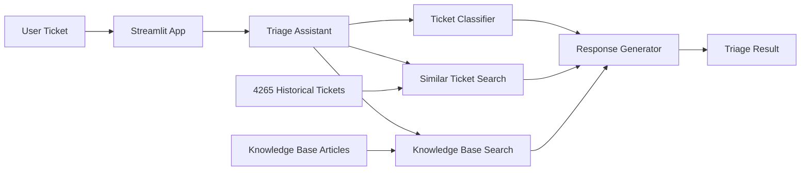

# AI ITSM Copilot
  

A ServiceNow-style IT service management prototype for ticket triage, similar-incident retrieval, knowledge-base recommendation, and support-response generation.

The current version combines rule-based classification with TF-IDF text similarity. It does not require an external AI or LLM API.

## What the application does

A user enters a new support ticket. The copilot then provides:

- recommended category
- recommended urgency
- recommended assignment group
- most similar historical support ticket
- similarity score and confidence assessment
- suggested resolution
- relevant knowledge-base articles
- user-facing response draft
- internal work note for support agents
- human-escalation recommendation when confidence is low

## Example ticket

```text
VPN is not connecting after I changed my password.
```

Example recommendations:

```text
Category: Network
Urgency: Medium
Assignment Group: Network Support
```

The application also retrieves a similar historical ticket and proposes a resolution based on the available support data.

## Public dataset integration

| Dataset stage | Tickets |
|---|---:|
| Original dataset | 28,587 |
| English tickets | 16,338 |
| Final ITSM subset | 4,265 |

**Source:** [Tobi-Bueck Customer Support Tickets dataset on Hugging Face](https://huggingface.co/datasets/Tobi-Bueck/customer-support-tickets)

The project initially used five manually created sample tickets.

It now supports a processed public customer-support dataset containing:

- 4,265 English ITSM-relevant tickets
- incident and problem ticket types
- technical-support, IT-support, and service-outage queues
- ticket descriptions
- priorities
- historical support answers

The source dataset is the `customer-support-tickets` dataset published by Tobi-Bueck on Hugging Face.

The original dataset contains synthetic support-ticket data. It should not be presented as confidential or real ServiceNow company data.

### Dataset processing

The preparation script:

1. loads the original CSV
2. keeps English-language tickets
3. removes rows missing essential fields
4. keeps ITSM-relevant queues
5. keeps `Incident` and `Problem` ticket types
6. cleans formatting artefacts and placeholders
7. combines the subject and body into one ticket description
8. generates project-compatible categories
9. saves the processed dataset in the format expected by the application

The processed dataset contains these columns:

```text
ticket_id
ticket_text
category
urgency
assignment_group
resolution
```

## Ticket categories

| Category | Tickets |
|---|---:|
| Software | 2,108 |
| Network | 688 |
| General | 627 |
| Service Outage | 502 |
| Access | 196 |
| Hardware | 108 |
| Email | 36 |
> These categories were generated by the project's rule-based classifier. They are not original ground-truth labels from the source dataset.

The current rule-based classifier supports:

- Network
- Access
- Hardware
- Email
- Software
- Service Outage
- General

`General` is used when the ticket does not match a sufficiently clear rule.

## Knowledge base

The prototype includes troubleshooting articles for:

- VPN connectivity
- password and account access
- laptop display problems
- Outlook email problems
- WiFi connectivity
- software application problems
- service outages

Knowledge articles are ranked using TF-IDF text similarity. Articles with no meaningful similarity are not displayed.

## Technology used

- Python
- Streamlit
- pandas
- scikit-learn
- TF-IDF vectorisation
- cosine similarity
- Git and GitHub

## Application Preview

<p align="center">
  
</p>
Example: software ticket triage with category, urgency, assignment group, similar ticket, KB article, draft response, and internal work note.


## System Architecture



The application receives a new support ticket, classifies it, searches historical tickets and knowledge-base articles, and then generates a triage recommendation with a suggested response.

## Project structure

```text
ai-itsm-copilot/
├── app/
│   └── streamlit_app.py
├── data/
│   ├── raw/
│   ├── processed/
│   ├── knowledge_base.csv
│   └── sample_tickets.csv
├── src/
│   ├── load_tickets.py
│   ├── ticket_classifier.py
│   ├── similar_ticket_search.py
│   ├── knowledge_base_search.py
│   ├── response_generator.py
│   ├── triage_assistant.py
│   ├── prepare_public_dataset.py
│   
├── README.md
├── requirements.txt
└── .gitignore
```

## Running the application

### 1. Open the project folder

```powershell
cd C:\Users\MK\Documents\ai-itsm-copilot
```

### 2. Activate the virtual environment

```powershell
.venv\Scripts\Activate.ps1
```

### 3. Install the dependencies

```powershell
pip install -r requirements.txt
```

### 4. Prepare the public dataset

After placing the downloaded source CSV in:

```text
data/raw/public_support_tickets_raw.csv
```

run:

```powershell
python src/prepare_public_dataset.py
```

### 5. Start the web application

```powershell
python -m streamlit run app/streamlit_app.py
```

## Current approach

The prototype currently uses:

- transparent keyword rules for triage classification
- TF-IDF and cosine similarity for historical-ticket retrieval
- TF-IDF retrieval for knowledge-base recommendations
- configurable confidence and escalation logic
- template-based support-response generation

This makes the system understandable and easy to test before introducing more advanced machine-learning or LLM components.

## Current limitations

- classification is based on manually defined rules
- ticket categories depend on keyword coverage
- similarity is lexical and does not fully understand meaning
- the public dataset is synthetic
- generated responses are template-based
- the application is a portfolio prototype, not a production ServiceNow integration

## Planned improvements

- evaluate classification quality on labelled test examples
- improve category rules and reduce false matches
- add semantic-embedding search
- add ticket filters and dataset statistics to the interface
- add automated tests
- add an optional LLM-based response layer
- explore integration with the ServiceNow API