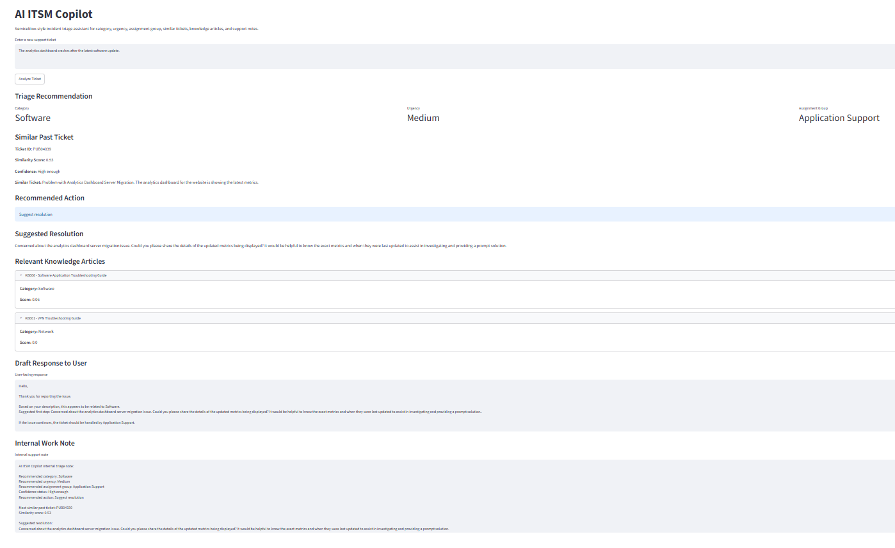
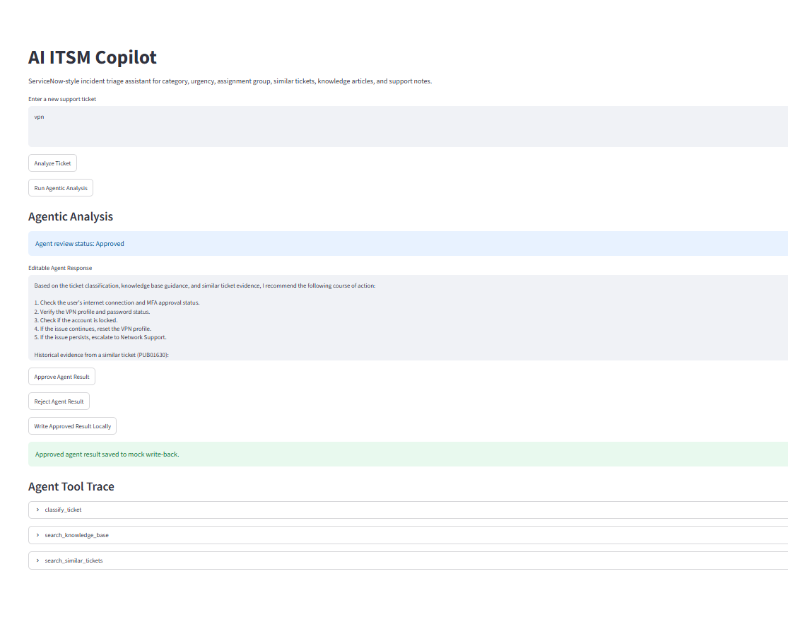
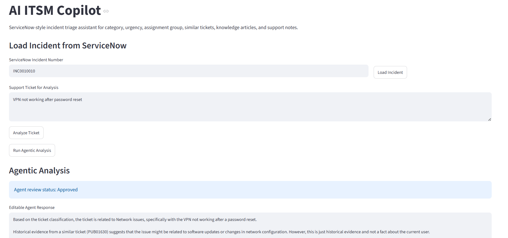
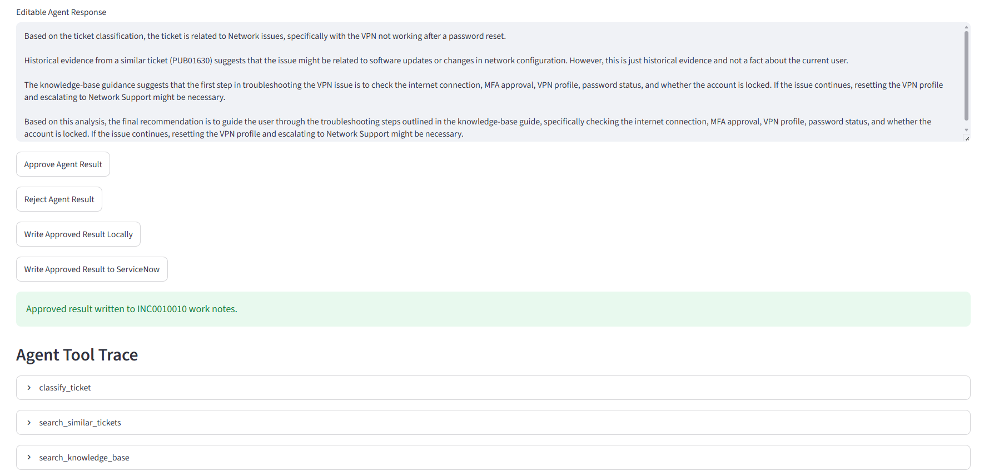
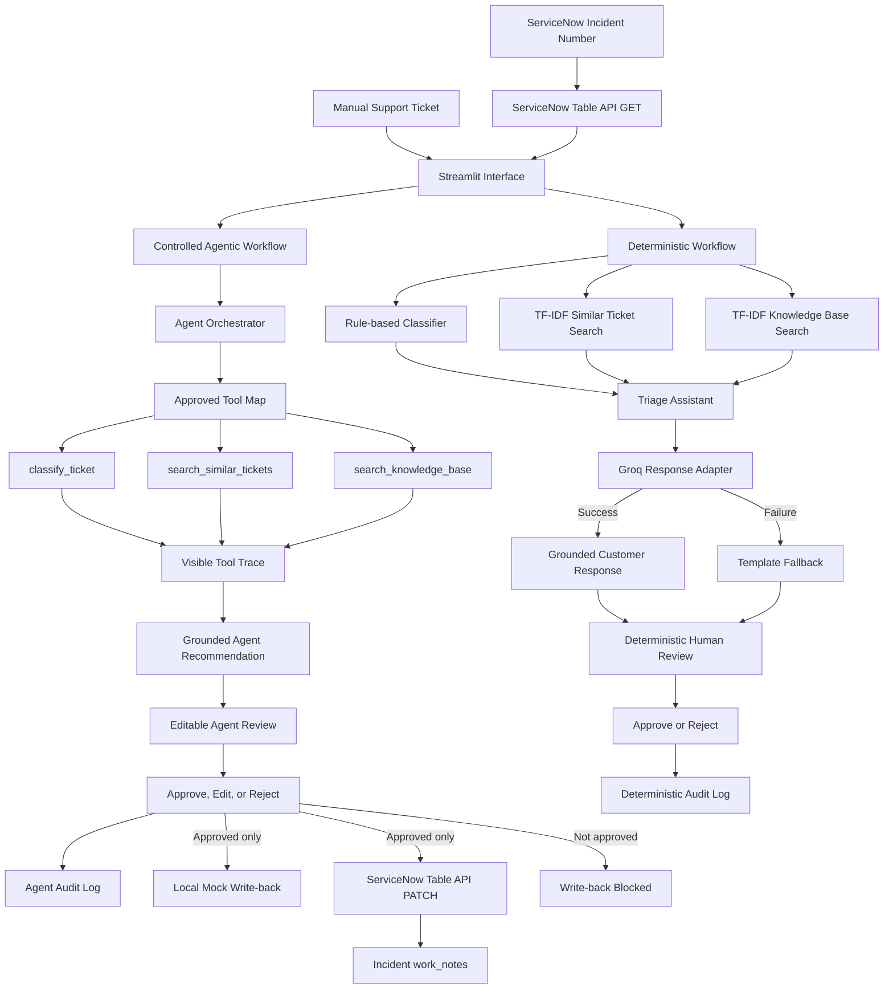

# AI ITSM Copilot


A human-in-the-loop, GenAI-enabled, tool-using ITSM copilot for support-ticket triage, historical-ticket retrieval, knowledge-base guidance, response generation, review, audit logging, and approval-controlled ServiceNow write-back.

The project supports three connected capabilities:

1. a reliable deterministic triage workflow
2. a controlled LLM-powered agentic workflow
3. a working ServiceNow incident read and approved `work_notes` write-back flow

The application is designed in a provider-neutral way, with Groq currently used as the first working LLM adapter.

---

## What the application does

A user can either enter a support ticket manually or load an incident from ServiceNow by incident number.

The application can then run either the deterministic workflow or the agentic workflow.

### Deterministic triage workflow

The deterministic workflow provides:

* recommended category
* recommended urgency
* recommended assignment group
* most similar historical support ticket
* similarity score and confidence assessment
* suggested resolution
* relevant knowledge-base articles
* LLM-generated or template-based customer response
* internal support work note
* human escalation when confidence is low
* editable response and work note
* human approval or rejection
* audit logging

### Controlled agentic workflow

The agentic workflow allows the LLM to choose the order and arguments for three approved tools:

* `classify_ticket`
* `search_similar_tickets`
* `search_knowledge_base`

The Python application executes only these approved mapped functions.

The agent workflow:

* limits the maximum number of reasoning rounds
* prevents repeated use of the same tool
* requires classification evidence
* requires historical-ticket evidence
* requires knowledge-base guidance
* sends tool results back to the LLM
* generates a grounded final recommendation
* records a visible tool trace
* clearly labels similar-ticket information as historical evidence
* prevents invented facts or contact information
* allows the final response to be edited
* requires human approval before write-back
* saves approval or rejection decisions to an audit log

### ServiceNow integration

The Streamlit application can:

* accept a ServiceNow incident number
* retrieve the matching incident through the ServiceNow Table API
* load the incident short description and description into the analysis field
* run the existing agentic workflow on the retrieved incident
* block ServiceNow write-back until the result is approved
* write the approved response to the incident `work_notes` field
* show a clear success or failure message
* clear stale agent results when a different incident is loaded

The working flow is:

```text
ServiceNow incident number
        ↓
Table API incident read
        ↓
Streamlit ticket field
        ↓
Controlled agentic analysis
        ↓
Human edit and approval
        ↓
Approved work note
        ↓
ServiceNow incident work_notes
```

This implementation has been manually validated with a ServiceNow Personal Developer Instance.

---

## Example ticket

```text
VPN is not connecting after I changed my password.
```

Example deterministic classification:

```text
Category: Network
Urgency: Medium
Assignment Group: Network Support
```

The application can also retrieve:

* a similar historical VPN ticket
* relevant VPN and password knowledge articles
* a practical suggested resolution
* a grounded customer-facing response
* an internal support work note

---

## Human-in-the-loop review

Both workflows include human review.

### Deterministic workflow

The user-facing response and internal work note can be edited before approval.

Available review actions:

* Approve Recommendation
* Reject Recommendation

### Agentic workflow

The final agent response is editable.

Available review actions:

* Approve Agent Result
* Reject Agent Result
* Write Approved Result Locally
* Write Approved Result to ServiceNow

Editing an already approved agent response changes its status back to:

```text
Edited - pending approval
```

This prevents edited content from being written locally or to ServiceNow without renewed human approval.

---

## Audit logging

The application stores human review decisions locally.

### Deterministic audit log

Runtime file:

```text
data/audit_log.csv
```

Recorded fields include:

* UTC timestamp
* original ticket
* review status
* recommended category
* recommended urgency
* recommended assignment group
* customer response
* internal work note

### Agent audit log

Runtime file:

```text
data/agent_audit_log.csv
```

Recorded fields include:

* UTC timestamp
* original ticket
* Approved or Rejected status
* edited final agent response
* names of tools used
* complete tool trace in JSON format

Runtime audit files are excluded from Git.

---

## Controlled write-back

The project currently supports two write-back paths.

### Local mock write-back

Runtime file:

```text
data/mock_writeback.csv
```

The local write-back function:

* blocks unapproved results
* accepts only an Approved agent result
* saves the approved response locally
* returns a clear success or failure message in Streamlit

This remains useful for offline demonstrations and testing.

### ServiceNow work-note write-back

The ServiceNow write-back function:

* requires a loaded ServiceNow incident
* requires the agent result to be Approved
* uses the incident `sys_id`
* sends the approved response to the incident `work_notes` field
* blocks unapproved or missing-incident write-back
* returns a clear success or failure message without exposing credentials

Important file:

```text
src/servicenow_service.py
```

---

## LLM integration

Groq is the first working LLM provider used by the project.

Current model:

```text
llama-3.1-8b-instant
```

Important files:

```text
src/llm_service.py
src/llm_response_generator.py
```

`llm_service.py` isolates provider-specific code so another provider can be added later without redesigning the full application.

The API key is loaded locally from:

```text
.env
```

The `.env` file is excluded from Git.

### Safe fallback

If Groq response generation fails, the deterministic workflow falls back to the original template response generator.

If the agentic workflow fails:

* the Streamlit application does not crash
* a safe user-facing error is displayed
* technical error details and API credentials are not exposed
* the deterministic Analyze Ticket workflow remains usable

---

## Public dataset integration

| Dataset stage | Tickets |
| --- | ---: |
| Original dataset | 28,587 |
| English tickets | 16,338 |
| Final ITSM subset | 4,265 |

**Source:** [Tobi-Bueck Customer Support Tickets dataset on Hugging Face](https://huggingface.co/datasets/Tobi-Bueck/customer-support-tickets)

The processed project dataset contains:

* 4,265 English ITSM-relevant tickets
* Incident and Problem ticket types
* Technical Support records
* IT Support records
* Service Outages and Maintenance records
* ticket descriptions
* priorities
* historical support answers

The source dataset contains synthetic support-ticket data.

It is not confidential company data and should not be presented as real ServiceNow incident data.

### Dataset processing

The preparation script:

1. loads the original CSV
2. keeps English-language tickets
3. removes rows missing essential fields
4. keeps ITSM-relevant queues
5. keeps Incident and Problem ticket types
6. cleans formatting artefacts and placeholders
7. combines subject and body into one ticket description
8. generates project-compatible categories
9. saves the processed dataset in the application format

Processed file:

```text
data/processed/public_support_tickets_processed.csv
```

Processed columns:

```text
ticket_id
ticket_text
category
urgency
assignment_group
resolution
```

The raw downloaded dataset is excluded from Git.

---

## Generated ticket categories

| Category | Tickets |
| --- | ---: |
| Software | 2,108 |
| Network | 688 |
| General | 627 |
| Service Outage | 502 |
| Access | 196 |
| Hardware | 108 |
| Email | 36 |

> These categories were generated by the project’s rule-based classifier. They are not original ground-truth labels from the source dataset.

`General` is used when a ticket does not match a sufficiently clear classification rule.

---

## Knowledge base

The project includes troubleshooting guidance for:

* VPN connectivity
* password and account access
* laptop display problems
* Outlook email problems
* WiFi connectivity
* software application problems
* service outages

Knowledge articles are ranked using TF-IDF and cosine similarity.

The deterministic workflow also includes a quality gate for historical resolutions.

If a retrieved historical resolution is vague, incomplete, or broken, the application uses practical knowledge-base guidance instead.

---

## Application preview

<p align="center">
  
</p>

### Agentic workflow

<p align="center">
  
</p>

Example: controlled tool-using analysis with an editable response, human approval, local mock write-back confirmation, and visible tool trace.

### ServiceNow integration

<p align="center">
  
</p>

Example: incident `INC0010010` loaded from ServiceNow and autofilled into the analysis workflow.

<p align="center">
  
</p>

Example: human-approved agent result written successfully to ServiceNow `work_notes`, with the controlled tool trace visible.

---

## System architecture



### Architecture principles

* deterministic workflow remains independently usable
* LLM provider logic is isolated
* the agent can execute only approved Python tools
* tool execution remains controlled by the application
* human approval is required before local or ServiceNow write-back
* stale agent results are cleared when another ServiceNow incident is loaded
* credentials remain in a local `.env` file excluded from Git
* ServiceNow-specific logic is isolated in `src/servicenow_service.py`

---

## Project structure

```text
ai-itsm-copilot/
|-- app/
|   `-- streamlit_app.py
|
|-- data/
|   |-- raw/
|   |-- processed/
|   |   `-- public_support_tickets_processed.csv
|   |-- knowledge_base.csv
|   `-- sample_tickets.csv
|
|-- docs/
|   `-- images/
|       |-- agentic-workflow-example.png
|       `-- software-ticket-example.png
|
|-- src/
|   |-- agent_orchestrator.py
|   |-- agent_tools.py
|   |-- audit_log.py
|   |-- knowledge_base_search.py
|   |-- llm_response_generator.py
|   |-- llm_service.py
|   |-- load_tickets.py
|   |-- mock_writeback.py
|   |-- prepare_public_dataset.py
|   |-- response_generator.py
|   |-- servicenow_service.py
|   |-- similar_ticket_search.py
|   |-- ticket_classifier.py
|   `-- triage_assistant.py
|
|-- tests/
|   `-- test_core_workflow.py
|
|-- .gitignore
|-- README.md
`-- requirements.txt
```

The following runtime and secret files are generated locally and excluded from Git:

```text
.env
data/audit_log.csv
data/agent_audit_log.csv
data/mock_writeback.csv
```

---

## Technology used

* Python
* Streamlit
* pandas
* scikit-learn
* TF-IDF vectorisation
* cosine similarity
* Groq API
* Llama 3.1 8B Instant
* ServiceNow Table API
* Python Requests
* python-dotenv
* Python `unittest`
* Git and GitHub

---

## Automated tests

The project currently includes fourteen passing automated tests.

Coverage includes:

* ticket classification tool
* similar-ticket search tool
* knowledge-base search tool
* controlled agent tool trace
* required tool execution
* Approved and Rejected audit logging
* blocked unapproved local write-back
* approved local mock write-back
* template fallback when the LLM fails

Run the tests with:

```powershell
python -m unittest discover -s tests -v
```

Expected result:

```text
Ran 14 tests

OK
```

The live ServiceNow connection is currently validated manually rather than through automated tests.

---

## Running the application

### 1. Open the project folder

```powershell
cd C:\Users\MK\Documents\ai-itsm-copilot
```

### 2. Activate the virtual environment

```powershell
.venv\Scripts\Activate.ps1
```

### 3. Install dependencies

```powershell
pip install -r requirements.txt
```

### 4. Configure local environment variables

Create a local `.env` file containing:

```text
GROQ_API_KEY=your_local_groq_key
SERVICENOW_INSTANCE_URL=https://your-instance.service-now.com
SERVICENOW_USERNAME=your_local_username
SERVICENOW_PASSWORD=your_local_password
```

Do not commit the `.env` file.

The current ServiceNow connection uses credentials from the local environment for development and Personal Developer Instance testing.

### 5. Prepare the public dataset

Place the downloaded source CSV at:

```text
data/raw/public_support_tickets_raw.csv
```

Then run:

```powershell
python src/prepare_public_dataset.py
```

### 6. Run the automated tests

```powershell
python -m unittest discover -s tests -v
```

### 7. Start the Streamlit application

```powershell
python -m streamlit run app/streamlit_app.py
```

### 8. Test the ServiceNow flow

1. enter a valid incident number
2. click **Load Incident**
3. click **Run Agentic Analysis**
4. review or edit the generated response
5. click **Approve Agent Result**
6. click **Write Approved Result to ServiceNow**
7. verify the new entry in the incident Activity or Work notes section

---

## Current limitations

* classification still depends on manually defined keyword rules
* generated categories are not ground-truth labels
* TF-IDF retrieval is mainly lexical
* the public dataset is synthetic
* Groq is currently the only implemented LLM adapter
* the agent uses only three approved tools
* audit logging and offline mock write-back use local CSV files
* ServiceNow authentication is development-oriented and not production OAuth
* ServiceNow knowledge articles are not yet retrieved
* resolved ServiceNow incidents are not yet imported into retrieval
* ServiceNow write-back currently targets only `work_notes`
* live ServiceNow integration is manually validated rather than covered by automated integration tests
* there is no application authentication or role-based access control
* there is no production monitoring or deployment configuration

---

## Next development steps

1. add automated tests around the ServiceNow service layer using mocked HTTP responses
2. add a ServiceNow integration screenshot to the README
3. retrieve resolved ServiceNow incidents for historical evidence
4. retrieve ServiceNow knowledge articles
5. add safer production authentication and role controls
6. add ML baselines and evaluation metrics for ticket classification

---

## Project status

The project can now be described accurately as:

```text
A human-in-the-loop, GenAI-enabled, ServiceNow-integrated ITSM copilot with controlled agent tools and approval-gated work-note write-back.
```

The current ServiceNow integration is an MVP validated with a Personal Developer Instance, not a production deployment.