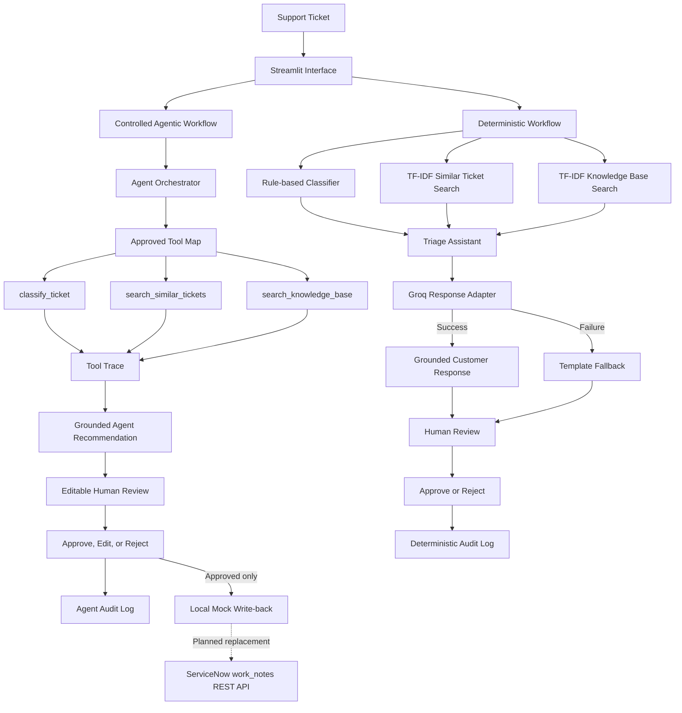

# AI ITSM Copilot


A human-in-the-loop, GenAI-enabled, tool-using ITSM copilot for support-ticket triage, historical-ticket retrieval, knowledge-base guidance, response generation, review, audit logging, and controlled local write-back.

The project currently supports two complementary workflows:

1. a reliable deterministic triage workflow
2. a controlled LLM-powered agentic workflow

The application is designed in a provider-neutral way, with Groq currently used as the first working LLM adapter.

> This project is not yet integrated with ServiceNow. The current write-back feature saves approved agent results locally and is designed to be replaced later by ServiceNow `work_notes` REST API write-back.

---

## What the application does

A user enters a support ticket in the Streamlit interface.

The application can then run either the deterministic workflow or the agentic workflow.

### Deterministic triage workflow

The deterministic workflow provides:

* recommended category
* recommended urgency
* recommended assignment group
* most similar historical support ticket
* similarity score and confidence assessment
* suggested resolution
* relevant knowledge-base articles
* LLM-generated or template-based customer response
* internal support work note
* human escalation when confidence is low
* editable response and work note
* human approval or rejection
* audit logging

### Controlled agentic workflow

The agentic workflow allows the LLM to choose the order and arguments for three approved tools:

* `classify_ticket`
* `search_similar_tickets`
* `search_knowledge_base`

The Python application executes only these approved mapped functions.

The agent workflow:

* limits the maximum number of reasoning rounds
* prevents repeated use of the same tool
* requires classification evidence
* requires historical-ticket evidence
* requires knowledge-base guidance
* sends tool results back to the LLM
* generates a grounded final recommendation
* records a visible tool trace
* clearly labels similar-ticket information as historical evidence
* prevents invented facts or contact information
* allows the final response to be edited
* requires human approval before local write-back
* saves approval or rejection decisions to an audit log

---

## Example ticket

```text
VPN is not connecting after I changed my password.
```

Example deterministic classification:

```text
Category: Network
Urgency: Medium
Assignment Group: Network Support
```

The application can also retrieve:

* a similar historical VPN ticket
* relevant VPN and password knowledge articles
* a practical suggested resolution
* a grounded customer-facing response
* an internal support work note

---

## Human-in-the-loop review

Both workflows include human review.

### Deterministic workflow

The user-facing response and internal work note can be edited before approval.

Available review actions:

* Approve Recommendation
* Reject Recommendation

### Agentic workflow

The final agent response is editable.

Available review actions:

* Approve Agent Result
* Reject Agent Result
* Write Approved Result Locally

Editing an already approved agent response changes its status back to:

```text
Edited - pending approval
```

This prevents an edited response from being written without renewed human approval.

---

## Audit logging

The application stores human review decisions locally.

### Deterministic audit log

Runtime file:

```text
data/audit_log.csv
```

Recorded fields include:

* UTC timestamp
* original ticket
* review status
* recommended category
* recommended urgency
* recommended assignment group
* customer response
* internal work note

### Agent audit log

Runtime file:

```text
data/agent_audit_log.csv
```

Recorded fields include:

* UTC timestamp
* original ticket
* Approved or Rejected status
* edited final agent response
* names of tools used
* complete tool trace in JSON format

Runtime audit files are excluded from Git.

---

## Controlled mock write-back

The current project includes a local mock write-back component.

Runtime file:

```text
data/mock_writeback.csv
```

The write-back function:

* blocks unapproved results
* accepts only an Approved agent result
* saves the approved response locally
* returns a clear success or failure message in Streamlit

This component is temporary.

Later, the same approval-controlled interface is intended to call the ServiceNow REST API and write the approved result into incident `work_notes`.

No ServiceNow API connection is currently claimed or implemented.

---

## LLM integration

Groq is the first working LLM provider used by the project.

Current model:

```text
llama-3.1-8b-instant
```

Important files:

```text
src/llm_service.py
src/llm_response_generator.py
```

`llm_service.py` isolates provider-specific code so that another provider can be added later without redesigning the full application.

The API key is loaded locally from:

```text
.env
```

The `.env` file is excluded from Git.

### Safe fallback

If Groq response generation fails, the deterministic workflow falls back to the original template response generator.

If the agentic workflow fails:

* the Streamlit application does not crash
* a safe user-facing error is displayed
* technical error details and API credentials are not exposed
* the deterministic Analyze Ticket workflow remains usable

---

## Public dataset integration

| Dataset stage     | Tickets |
| ----------------- | ------: |
| Original dataset  |  28,587 |
| English tickets   |  16,338 |
| Final ITSM subset |   4,265 |

**Source:** [Tobi-Bueck Customer Support Tickets dataset on Hugging Face](https://huggingface.co/datasets/Tobi-Bueck/customer-support-tickets)

The processed project dataset contains:

* 4,265 English ITSM-relevant tickets
* Incident and Problem ticket types
* Technical Support records
* IT Support records
* Service Outages and Maintenance records
* ticket descriptions
* priorities
* historical support answers

The source dataset contains synthetic support-ticket data.

It is not confidential company data and should not be presented as real ServiceNow incident data.

### Dataset processing

The preparation script:

1. loads the original CSV
2. keeps English-language tickets
3. removes rows missing essential fields
4. keeps ITSM-relevant queues
5. keeps Incident and Problem ticket types
6. cleans formatting artefacts and placeholders
7. combines subject and body into one ticket description
8. generates project-compatible categories
9. saves the processed dataset in the application format

Processed file:

```text
data/processed/public_support_tickets_processed.csv
```

Processed columns:

```text
ticket_id
ticket_text
category
urgency
assignment_group
resolution
```

The raw downloaded dataset is excluded from Git.

---

## Generated ticket categories

| Category       | Tickets |
| -------------- | ------: |
| Software       |   2,108 |
| Network        |     688 |
| General        |     627 |
| Service Outage |     502 |
| Access         |     196 |
| Hardware       |     108 |
| Email          |      36 |

> These categories were generated by the project’s rule-based classifier. They are not original ground-truth labels from the source dataset.

`General` is used when a ticket does not match a sufficiently clear classification rule.

---

## Knowledge base

The project includes troubleshooting guidance for:

* VPN connectivity
* password and account access
* laptop display problems
* Outlook email problems
* WiFi connectivity
* software application problems
* service outages

Knowledge articles are ranked using TF-IDF and cosine similarity.

The deterministic workflow also includes a quality gate for historical resolutions.

If a retrieved historical resolution is vague, incomplete, or broken, the application uses practical knowledge-base guidance instead.

---

## Application preview

<p align="center">
  
</p>

The screenshot currently shows the original deterministic triage workflow.

An updated agentic-workflow screenshot will be added after the final interface review.

---

## System architecture



### Architecture principles

* deterministic workflow remains independently usable
* LLM provider logic is isolated
* the agent can execute only approved Python tools
* tool execution remains controlled by the application
* human approval is required before write-back
* ServiceNow integration is clearly separated as future work

---

## Project structure

```text
ai-itsm-copilot/
|-- app/
|   `-- streamlit_app.py
|
|-- data/
|   |-- raw/
|   |-- processed/
|   |   `-- public_support_tickets_processed.csv
|   |-- knowledge_base.csv
|   `-- sample_tickets.csv
|
|-- docs/
|   `-- images/
|       `-- software-ticket-example.png
|
|-- src/
|   |-- agent_orchestrator.py
|   |-- agent_tools.py
|   |-- audit_log.py
|   |-- knowledge_base_search.py
|   |-- llm_response_generator.py
|   |-- llm_service.py
|   |-- load_tickets.py
|   |-- mock_writeback.py
|   |-- prepare_public_dataset.py
|   |-- response_generator.py
|   |-- similar_ticket_search.py
|   |-- ticket_classifier.py
|   `-- triage_assistant.py
|
|-- tests/
|   `-- test_core_workflow.py
|
|-- .gitignore
|-- README.md
`-- requirements.txt
```

The following runtime files are generated locally and excluded from Git:

```text
.env
data/audit_log.csv
data/agent_audit_log.csv
data/mock_writeback.csv
```

---

## Technology used

* Python
* Streamlit
* pandas
* scikit-learn
* TF-IDF vectorisation
* cosine similarity
* Groq API
* Llama 3.1 8B Instant
* Python `unittest`
* Git and GitHub

---

## Automated tests

The project currently includes eight passing automated tests.

Coverage includes:

* ticket classification tool
* similar-ticket search tool
* knowledge-base search tool
* controlled agent tool trace
* required tool execution
* Approved and Rejected audit logging
* blocked unapproved write-back
* approved mock write-back
* template fallback when the LLM fails

Run the tests with:

```powershell
python -m unittest discover -s tests -v
```

Expected result:

```text
Ran 8 tests

OK
```

---

## Running the application

### 1. Open the project folder

```powershell
cd C:\Users\MK\Documents\ai-itsm-copilot
```

### 2. Activate the virtual environment

```powershell
.venv\Scripts\Activate.ps1
```

### 3. Install dependencies

```powershell
pip install -r requirements.txt
```

### 4. Configure the Groq key locally

Create a local `.env` file containing the Groq configuration required by `src/llm_service.py`.

Do not commit the `.env` file.

### 5. Prepare the public dataset

Place the downloaded source CSV at:

```text
data/raw/public_support_tickets_raw.csv
```

Then run:

```powershell
python src/prepare_public_dataset.py
```

### 6. Run the automated tests

```powershell
python -m unittest discover -s tests -v
```

### 7. Start the Streamlit application

```powershell
python -m streamlit run app/streamlit_app.py
```

---

## Current limitations

* classification still depends on manually defined keyword rules
* generated categories are not ground-truth labels
* TF-IDF retrieval is mainly lexical
* the public dataset is synthetic
* Groq is currently the only implemented LLM adapter
* the agent uses only three approved tools
* audit and write-back storage currently use local CSV files
* there is no authentication or role-based access control
* there is no production monitoring
* the application is not yet connected to a ServiceNow instance
* local mock write-back is not the same as ServiceNow `work_notes` write-back

---

## Planned ServiceNow phase

ServiceNow integration will begin only after the current agentic workflow is stable.

The planned sequence is:

1. connect to a free ServiceNow Personal Developer Instance
2. enter an incident number in Streamlit
3. load the incident through the ServiceNow REST API
4. analyse the incident using the existing controlled agent
5. allow a human to edit, approve, or reject the result
6. write only the approved result to ServiceNow `work_notes`
7. retrieve resolved ServiceNow incidents
8. retrieve ServiceNow knowledge articles

Until these API operations work, the project should be described as:

```text
Human-in-the-loop, GenAI-enabled, tool-using ITSM copilot
```

It should not yet be described as ServiceNow-integrated.
